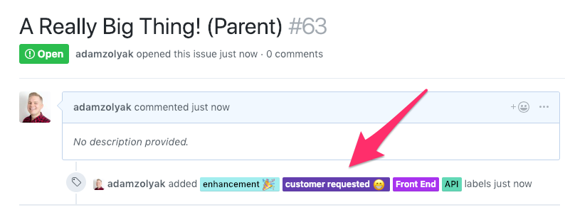
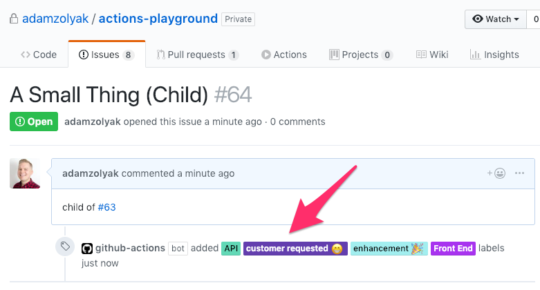

# 👩‍👧‍👦 Mirror Labels to Child - GitHub Action

A [GitHub Action](https://github.com/features/actions) that mirrors labels from a parent issue to it's children issues 👩‍👧‍👦. The action supports the [child keywords supported by actions-playground](https://help.waffle.io/epics/which-keywords-are-supported-with-epics) - `child #<issue_number>`, `child to #<issue_number>`, `child of #<issue_number>`. The `child <owner>/<repo>#<issue_number>` syntax is also supported for cross repo relationships.

## How It Works

This GitHub Action runs when an [`issues` event webhook](https://developer.github.com/v3/activity/events/types/#issuesevent) is fired in your GitHub repo. The action checks if there is a [parent / child relationship](https://help.waffle.io/epics/which-keywords-are-supported-with-epics) between the issue and another issue. If so, the action mirrors labels from the parent issue to the child issue.

Notes:

- If a label is removed from a parent issue, the label is is not removed from the child issue.
- If a label is added to the parent issue, it will be applied to the child issue the next time the child is edited.
- If a child has multiple parents, only the lables from the child's first parent are mirrored to the child.

## Examples

Example of parent issue with labels:


Example of child issue of parent issue with labels mirrored from parent issue:


## Installation

To use this GitHub Action, you must have access to [GitHub Actions](https://github.com/features/actions). GitHub Actions are currently only available in private beta (you must [apply for access](https://github.com/features/actions)) and only work in private repos.

To setup this action:

1. Create a `.github/worksflows/main.yml` in your GitHub repo ([more info](https://help.github.com/en/articles/configuring-a-workflow)).
2. Add the following code to the `main.yml` file and commit it to the repo's `master` branch.

```yaml
name: Mirror Labels to Child Issue

on: issues

jobs:
  mirrorLabels:
    name: Mirror Labels to Child Issue
    runs-on: ubuntu-latest
    steps:
      - name: Label PRs
        uses: tinkurlab/mirror-labels-to-child-action@master
        env:
          GITHUB_TOKEN: ${{ secrets.GITHUB_TOKEN }}
```

3. Whenever you create, update, close, or reopen an issue, the action will run!

## Contributing

If you have suggestions for how this GitHub Action could be improved, or want to report a bug, open an issue! Or pull request! We'd love all and any contributions. For more, check out the [Contributing Guide](CONTRIBUTING.md).

## License

[ISC](LICENSE) © 2021 Adam Zolyak <adam@tinkurlab.com> (www.tinkurlab.com)
